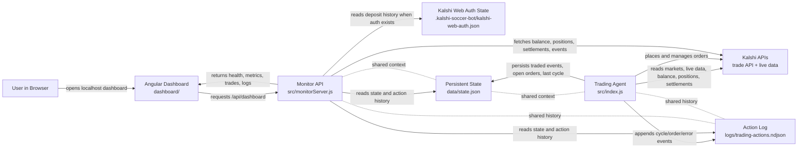
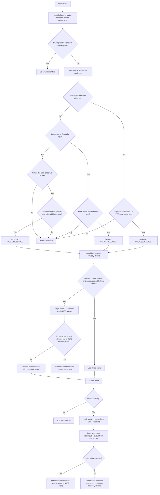
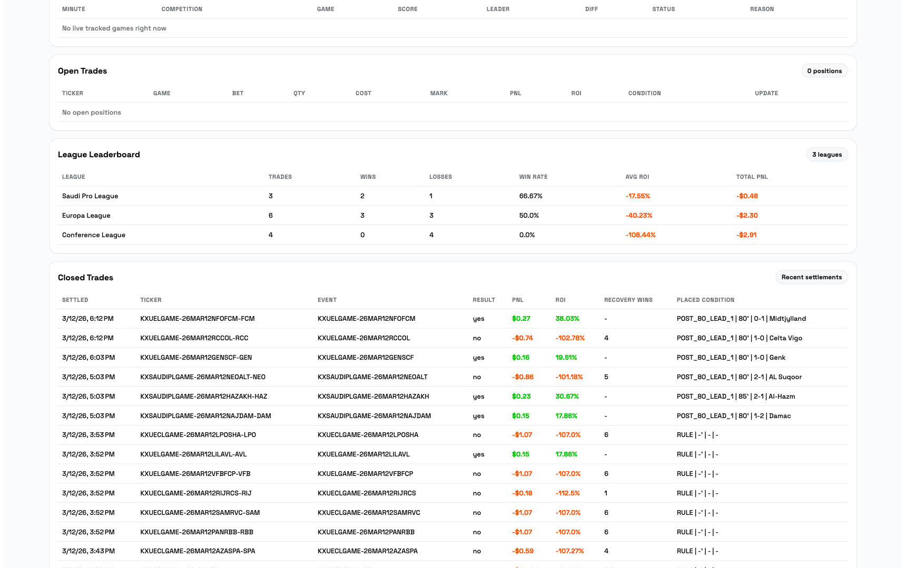
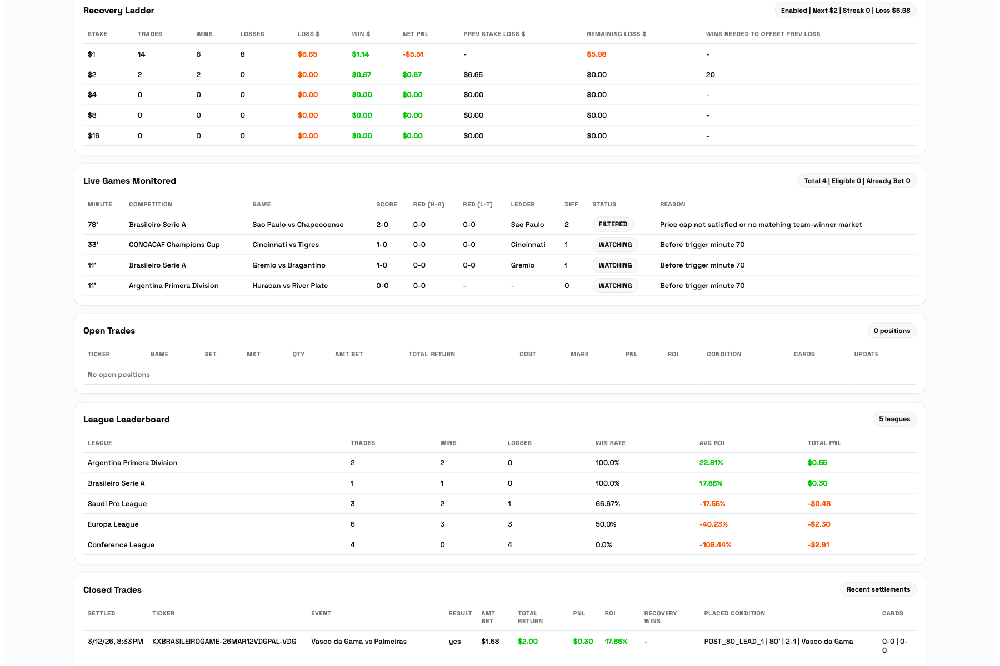
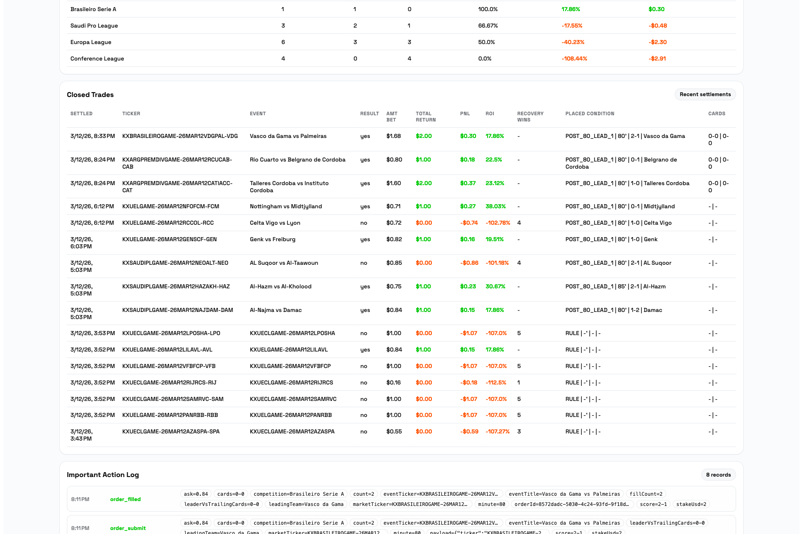
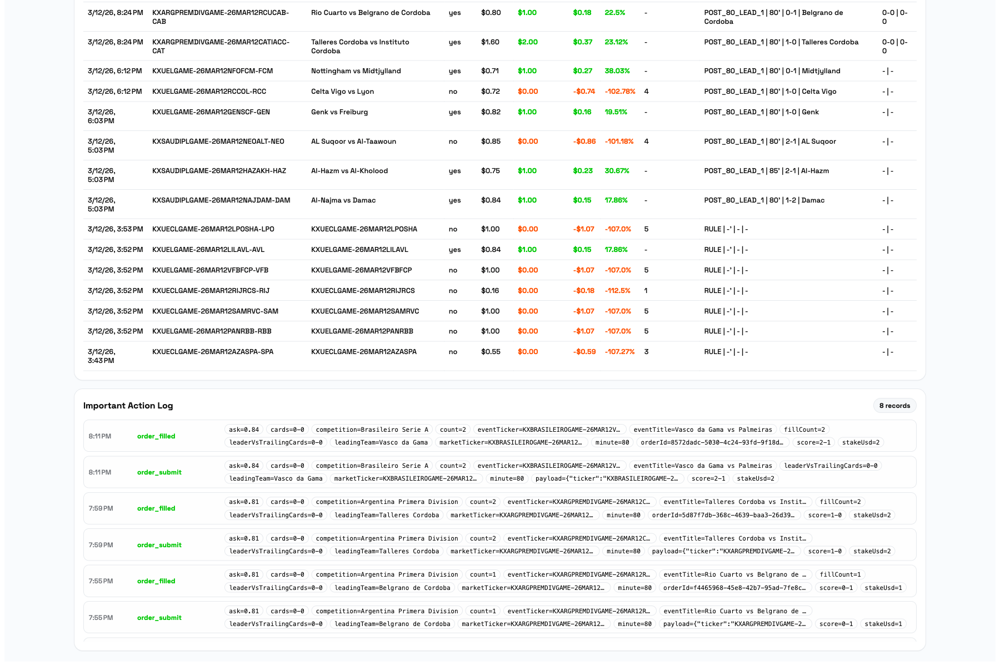

# Kalshi Soccer In-Play Trading Bot + Dashboard

Node.js trading engine + monitor API + Angular dashboard for Kalshi soccer match-winner markets.

The bot scans live soccer events, applies rule-based entry logic, places IOC orders, enforces risk controls, and records all trading actions for analysis.

## Prerequisites

- Node.js `>= 20.19.0` (Angular 21 compatible)
- npm
- Kalshi API key ID + RSA private key in a local `.pem` file

Check versions:

```bash
node -v
npm -v
```

## Security First

- Never commit `.env` or `.pem` key files.
- Rotate any key that was ever pasted into chat or logs.
- Use `KALSHI_PRIVATE_KEY_PATH` (file path) instead of inline PEM in env.

## Architecture

- Trading engine: `src/index.js`
- Strategy rules: `src/strategy.js`
- Monitor API: `src/monitorServer.js` (`/api/health`, `/api/dashboard`)
- Dashboard (Angular 21): `dashboard/`
- Persistent state: `data/state.json`
- Action logs: `logs/trading-actions.ndjson`

### Runtime flow



How these three pieces work together:

- The trading agent is the worker that talks to Kalshi, evaluates signals, places orders, and writes trade memory plus action logs.
- The monitor API is the read-model layer for the UI. It combines Kalshi account data with local state and logs, then exposes one dashboard-friendly JSON response.
- The dashboard never talks directly to Kalshi. It only talks to the monitor API on localhost and refreshes the view every few seconds.
- `data/state.json` and `logs/trading-actions.ndjson` are the bridge between the agent and the API, so the dashboard can explain not just what is open now, but how and why the bot got there.

## Strategy (Current Implementation)

### Market scope

- Soccer only.
- League filter from `LEAGUES`:
  - `LEAGUES=ALL` means all soccer competitions detected on Kalshi.
  - comma-separated list means explicit whitelist only.

### Entry conditions

1. Live game data must be available (minute + score).
2. Team must be leading by either:
   - `MIN_GOAL_LEAD` or more right now at the time of entry (default: 2-goal lead)
   - `POST80_MIN_GOAL_LEAD` at/after `POST80_START_MINUTE` (now `85`, default late-rule lead: 1 goal)
   - or, at/after minute `85`, the match is tied and the bot buys `Tie = YES`
3. Leading team red-card filter:
   - skip if `leadingTeamRedCards > trailingTeamRedCards` (when card data is available).
4. Late tie red-card filter:
   - late tie entries only qualify when both teams have the same number of red cards
   - if card data is unavailable, the trade is skipped
5. Market must be active and look like a valid match-winner outcome market.
6. YES ask price must be at or below:
   - `min(MAX_YES_PRICE, ANYTIME_LARGE_LEAD_MAX_YES_PRICE)` for the current 2+ lead signal
   - `min(MAX_YES_PRICE, POST80_MAX_YES_PRICE)` for the late 1-goal rule starting at minute `85`
   - `min(MAX_YES_PRICE, POST80_MAX_YES_PRICE)` for the late tie rule starting at minute `85`
7. Event is skipped if already traded (one filled entry per event).

### Order behavior

- Side: Buy `YES` on leading team market.
- Type: GTC limit order (`time_in_force=good_till_canceled`).
- Limit price:
  - order can fill at any price at or below the signal's configured cap
  - the bot never posts above the stage-specific max price cap (for example `0.90`)
- Contracts: sized against the configured limit price, not just the current ask snapshot.
- Resting-order safety model:
  - at most one bot-managed resting order is allowed per event
  - resting orders are canceled automatically if the signal becomes invalid, the market mapping changes, trading is paused, stop-loss is hit, or the bot is already at max position capacity
  - if a GTC order partially fills, any remaining quantity is canceled immediately so the bot cannot overfill the same event later

### Risk controls

- Daily stop-loss: `MAX_DAILY_LOSS_USD` using settlement PnL and `TIMEZONE` day boundaries.
- Max concurrent open positions: `MAX_OPEN_POSITIONS`.
- Skip if insufficient available cash balance.

### Recovery queue sizing (optional)

Controlled by:

- `RECOVERY_MODE_ENABLED`
- `RECOVERY_STAKE_USD`
- `RECOVERY_MAX_STAKE_USD`

Current queue logic:

- Base stake remains `STAKE_USD` when there are no unresolved closed losses.
- Only settled losing trades create recovery targets.
- Open unrealized PnL does not affect recovery sizing.
- The next trade targets the oldest unresolved loss using Kalshi fee-aware sizing.
- Only one in-flight recovery attempt is allowed for the current oldest unresolved loss.
- Dashboard shows the recovery queue, remaining loss balance, and linked recovery attempts.

### Recovery bug fix: root cause and current behavior

Root cause of the duplicate recovery-bet issue:

- Recovery targets were built only from settled losses.
- A recovery trade that had already been placed but had not settled yet did not reserve its `recoveryQueueId`.
- On later scans, the bot still saw the same oldest unresolved loss as available and could size another recovery trade against it.
- That made one closed loss capable of spawning multiple recovery bets before the first recovery attempt resolved.

How recovery works now:

- The oldest unresolved closed loss remains the active recovery target.
- As soon as the bot places a recovery order, that queue item is treated as locked in-flight.
- While that recovery trade is open, resting, or simply not settled yet, the bot will not place another recovery trade for the same queue item.
- Once the recovery trade settles, the queue is recalculated from actual closed-trade results and the bot either:
  - marks the loss as fully resolved,
  - keeps it partially unresolved and waits for one new recovery attempt,
  - or advances to the next queued loss if the oldest one is fully recovered.

### Strategy and recovery flow



## Strategy Log and Rule History

This project keeps historical trigger labels in persisted trade metadata and action logs. That means older trades can still show strategy IDs that are no longer active. The current rule set and prior rule labels are documented below so dashboard rows and logs remain interpretable over time.

### Current active trigger rules

- `CURRENT_LEAD_2`
  - Current implementation for the early/main signal.
  - Meaning: the currently leading team must be ahead by `MIN_GOAL_LEAD` right now at the moment of entry.
  - Default current setup: leader must be up by `2+` goals now.
- `POST_85_LEAD_1`
  - Current late-game signal.
  - Meaning: once the match reaches minute `85` or later, a team leading by `1+` goal can qualify.
  - Uses the late-rule price cap `POST80_MAX_YES_PRICE`.
- `POST_85_TIE_YES`
  - Current late-game tie signal.
  - Meaning: once the match reaches minute `85` or later, a tied match can qualify for `Tie = YES`.
  - Requires equal red cards for both teams and uses the same late-rule price cap `POST80_MAX_YES_PRICE`.

### Historical trigger rules still found in saved logs/state

- `ANYTIME_LEAD_2`
  - Older rule that allowed entry if the current leader had reached a `2+` goal lead at any earlier point in the match, even if the lead had narrowed by entry time.
  - This rule is no longer active and was replaced by `CURRENT_LEAD_2`.
- `POST_80_LEAD_1`
  - Older late-game rule that started at minute `80`.
  - This rule is no longer active and was replaced by `POST_85_LEAD_1`.
- `POST_70_LEAD_2`
  - Older lead-based entry rule seen in historical trades/logs.
  - This rule is no longer active.

### Sizing modes recorded in logs

- `BASE`
  - Standard non-recovery order sizing using the configured base stake.
- `RECOVERY_QUEUE_CAPPED`
  - Recovery mode sizing where the order was capped by current balance and/or `RECOVERY_MAX_STAKE_USD` instead of fully reaching the target recovery profit.

### Notes on historical logs

- `data/state.json` and `logs/trading-actions.ndjson` preserve the original trigger labels used at the time of each trade.
- The dashboard intentionally shows those original labels for historical accuracy, even if the live strategy has changed since then.

### Dated strategy update log

- `2026-03-16` `POST_85_TIE_YES` added
  - Decision: add late tie entries at/after minute `85` when `Tie = YES` is priced at or below `90c` and both teams have equal red cards.
  - Reason: increase the number of eligible bets and playable games without taking materially different late-game risk than the existing `POST_85_LEAD_1` rule.
- `2026-03-15` `CURRENT_LEAD_2` replaced `ANYTIME_LEAD_2`
  - Decision: require the team to be currently leading by `2+` goals at entry instead of only having led by `2+` at some earlier point.
  - Reason: prevent trades from firing after a lead had already narrowed, which made the dashboard condition text misleading and loosened the intended setup.
- `2026-03-15` `POST_85_LEAD_1` replaced `POST_80_LEAD_1`
  - Decision: move the late 1-goal rule from minute `80` to minute `85`.
  - Reason: make late one-goal entries more conservative while keeping the strategy active in endgame situations.

## Setup

1. Install dependencies:

```bash
npm install
cd dashboard && npm install && cd ..
```

2. Create local env file:

```bash
cp .env.example .env
```

3. Fill `.env` values (especially Kalshi credentials + key path).

## Runner Handoff Checklist

If someone else is going to run this project, hand them the following:

1. A copy of `.env` with values appropriate for their machine and account.
2. The Kalshi RSA private key file referenced by `KALSHI_PRIVATE_KEY_PATH`, stored locally on their machine.
3. Clear confirmation of whether they should run in `DRY_RUN=true` or live trading mode.
4. A starting `STATE_FILE` only if you intentionally want to preserve existing traded-event memory and recovery context. Otherwise let them start with a fresh state file.
5. Optional dashboard extras:
   - the existing Kalshi web auth state file if invested-capital tracking is expected

Do not hand off:

- committed `.env` files
- private keys inside chat, email, or source control
- stale Kalshi web session cookies without telling the runner they may expire

## AI Agent Bootstrap Prompt

Use this prompt when you want another AI coding agent to get the project running with minimal back-and-forth. Replace every bracketed placeholder before sending it to the agent. The non-secret defaults below mirror the current operating defaults from the maintainer's `.env`. This version assumes everything runs on localhost only.

```text
You are setting up and running the project at:
/absolute/path/to/kalshi-soccer-trading-bot

Your job is to get the app running end-to-end without asking me for setup help unless a value below is missing or invalid.

Project goals:
- Start the trading engine
- Start the monitor API
- Start the Angular dashboard
- Verify that the health endpoint and dashboard load
- Launch every required process yourself instead of asking the user to run commands
- Use the provided defaults unless a value below explicitly overrides them

Required context you can rely on:

Repository path:
- [ABSOLUTE_REPO_PATH]

Node environment:
- Node version available: [NODE_VERSION or "unknown"]
- npm version available: [NPM_VERSION or "unknown"]

Kalshi API credentials:
- KALSHI_API_BASE_URL=https://api.elections.kalshi.com/trade-api/v2
- KALSHI_API_KEY_ID=[PROVIDE_REAL_KEY_ID]
- KALSHI_PRIVATE_KEY_PATH=[PROVIDE_ABSOLUTE_PATH_TO_PEM]
- KALSHI_PRIVATE_KEY_PEM=[OPTIONAL_IF_NOT_USING_PATH]

Trading mode and runtime defaults:
- DRY_RUN=false
- POLL_SECONDS=10
- TIMEZONE=America/New_York
- LOG_LEVEL=info

Strategy defaults:
- MIN_TRIGGER_MINUTE=70
- MIN_GOAL_LEAD=2
- RETRY_UNTIL_MINUTE=80
- STAKE_USD=1
- ESTIMATED_WIN_PROBABILITY=0.92
- FEE_BUFFER=0.02
- MAX_YES_PRICE=
- POST80_START_MINUTE=85
- POST80_MIN_GOAL_LEAD=1
- POST80_MAX_YES_PRICE=0.90

Liquidity defaults:
- MIN_VOLUME_24H_CONTRACTS=50
- MIN_LIQUIDITY_DOLLARS=250

Risk defaults:
- MAX_OPEN_POSITIONS=20
- MAX_DAILY_LOSS_USD=50

Recovery defaults:
- RECOVERY_MODE_ENABLED=true
- RECOVERY_STAKE_USD=2
- RECOVERY_MAX_STAKE_USD=50

League scope:
- LEAGUES=ALL

Localhost assumptions:
- MONITOR_API_TOKEN=
- DASHBOARD_API_BASE_URL=
- DASHBOARD_API_TOKEN=

Kalshi web invested-capital tracking:
- KALSHI_WEB_AUTH_STATE_PATH=./.kalshi-soccer-bot/kalshi-web-auth.json
- INVESTED_START_DATE=2026-03-01T00:00:00Z

State and overrides:
- STATE_FILE=./data/state.json
- RUNTIME_OVERRIDES_FILE=./data/runtime-overrides.json

What I want you to do:
1. Inspect the repo and install all required dependencies in both the root project and the dashboard.
2. Create or update `.env` using exactly the values above.
3. Verify that the private key file exists and is readable.
4. Run `npm run kalshi:web-auth` to establish or refresh Kalshi web auth for invested-capital tracking.
5. When the browser opens, explicitly prompt the user to log into Kalshi there, then continue once login is complete and the auth-state file is saved.
6. Start the monitor API and confirm `/api/health` responds successfully.
7. Start the Angular dashboard and confirm it can reach the API.
8. Start the trading engine in the configured mode.
9. Report which processes are running, which URLs are available, and any setup problems you had to fix.

Rules:
- Do not change strategy values unless they are clearly invalid.
- Prefer using existing npm scripts from `package.json`.
- Start the monitor API, dashboard, and trading engine yourself in separate terminals/sessions so they can run concurrently.
- Do not ask the user to run local commands for you unless a step truly requires human interaction in a browser login flow.
- If a secret value above is blank, treat that feature as optional and skip it safely.
- Always run `npm run kalshi:web-auth` during setup for invested-capital tracking unless the user explicitly says to skip deposit tracking.
- When that command opens the browser, ask the user to complete the Kalshi login there and wait for them before moving on.
- If anything fails, debug it and continue until the app is runnable.
```

Minimum values the human must provide before using the prompt:

- `KALSHI_API_KEY_ID`
- `KALSHI_PRIVATE_KEY_PATH` or `KALSHI_PRIVATE_KEY_PEM`
- the correct absolute repo path

Optional values the human should provide only if they want those features:

- enough access to complete the browser login when the agent runs `npm run kalshi:web-auth`

How this Kalshi web auth-state file is obtained:

- run `npm run kalshi:web-auth`
- the script opens a browser window to Kalshi
- log into Kalshi normally as the account owner
- the script saves the authenticated browser state locally to `.kalshi-soccer-bot/kalshi-web-auth.json`
- after that, the monitor API can use that local file to read deposit history without manually copying cookies or CSRF tokens

## Run (3 terminals)

### 1) Trading engine

Dry run:

```bash
npm run start:dry
```

Live mode:

```bash
DRY_RUN=false npm start
```

### 2) Monitor API backend

```bash
npm run monitor:api
```

Health endpoints:

- `http://localhost:8787/api/health`
- `http://localhost:8787/api/dashboard`

### 3) Dashboard frontend

```bash
npm run dashboard:dev
```

UI:

- `http://localhost:4200`

## Dashboard Screenshots (Updated)

### 1. Overview (Chart.js all-time PnL + KPI cards)



### 2. Recovery queue + live games + open trades



### 3. League leaderboard + closed trades



### 4. Closed trades + action log



## `.env` Configuration Reference

### Authentication

- `KALSHI_API_BASE_URL`
  - Why: base URL for the signed Kalshi trading API requests.
  - Usually use the default `https://api.elections.kalshi.com/trade-api/v2`.
  - Where to get it: from Kalshi API docs if they change environments or endpoints.
- `KALSHI_API_KEY_ID`
  - Why: identifies the Kalshi API key used to sign every authenticated request.
  - Where to get it: from the runner's own Kalshi API key management page in their Kalshi account.
  - Required: yes.
- `KALSHI_PRIVATE_KEY_PATH`
  - Why: points to the RSA private key file paired with `KALSHI_API_KEY_ID`.
  - Where to get it: from the `.pem` file generated and downloaded when the Kalshi API key was created.
  - Required: yes, unless using `KALSHI_PRIVATE_KEY_PEM`.
- `KALSHI_PRIVATE_KEY_PEM`
  - Why: inline fallback for the private key when a file path is not practical.
  - Where to get it: same private key material as the `.pem` file.
  - Required: no.
  - Note: avoid this for normal use because it is easier to leak in shell history or logs.
- `KALSHI_WEB_AUTH_STATE_PATH`
  - Why: local file the project uses to store browser auth state for Kalshi web deposit-history access.
  - Where to get it: generated locally by running `npm run kalshi:web-auth`.
  - Required: only for invested-capital tracking from deposit history.
- `KALSHI_WEB_USER_ID`
  - Why: identifies the logged-in Kalshi web user when using raw session env vars instead of saved auth state.
  - Where to get it: from the authenticated Kalshi web app session or existing internal setup notes.
  - Required: only if not using `KALSHI_WEB_AUTH_STATE_PATH`.
- `KALSHI_WEB_SESSION_COOKIE`
  - Why: lets the monitor API call Kalshi's web endpoints for deposit history.
  - Where to get it: from the authenticated `sessions` cookie in Kalshi web, or avoided entirely by using `npm run kalshi:web-auth`.
  - Required: only if not using `KALSHI_WEB_AUTH_STATE_PATH`.
- `KALSHI_WEB_CSRF_TOKEN`
  - Why: companion auth token for Kalshi web deposit-history requests.
  - Where to get it: from the authenticated Kalshi web app session, or avoided entirely by using `npm run kalshi:web-auth`.
  - Required: only if not using `KALSHI_WEB_AUTH_STATE_PATH`.
- `INVESTED_START_DATE`
  - Why: tells the dashboard which deposits count toward "Total Amount Invested".
  - Where to get it: choose the start date that matches when this strategy/account funding period began.
  - Required: no, but useful for accurate ROI and capital reporting.

### One-Time Kalshi web auth for deposit-based invested capital

To avoid manually updating web session env vars, run:

```bash
npm install
npm run kalshi:web-auth
```

This opens a browser, lets you log into Kalshi normally, and saves local browser auth state to `.kalshi-soccer-bot/kalshi-web-auth.json`.

After that, restart the monitor API:

```bash
npm run monitor:api
```

The dashboard will then read deposit history automatically from the saved web session. Re-run `npm run kalshi:web-auth` only when Kalshi eventually expires the session.

### Bot runtime

- `DRY_RUN`
  - Why: controls whether the trading engine places real orders or only logs what it would do.
  - Where to get it: this is an operating decision, not an external credential.
  - Typical handoff: set to `true` for new runners until everything is verified.
- `POLL_SECONDS`
  - Why: sets how often the engine scans live events and reevaluates signals.
  - Where to get it: choose based on desired responsiveness and API usage tolerance.
- `TIMEZONE`
  - Why: determines when daily PnL resets for stop-loss calculations and dashboard day boundaries.
  - Where to get it: choose the operating timezone for the trading workflow, often `America/New_York`.
- `LOG_LEVEL`
  - Why: controls how verbose runtime logs are.
  - Where to get it: operational preference, usually `info`.

### Strategy thresholds

- `MIN_TRIGGER_MINUTE`
  - Why: earliest in-match minute the main signal is allowed to act.
  - Where to get it: strategy choice.
- `MIN_GOAL_LEAD`
  - Why: minimum current lead required for the main lead-based rule.
  - Where to get it: strategy choice.
- `ANYTIME_LARGE_LEAD_MIN_GOAL_LEAD`
  - Why: minimum lead size for the large-lead path.
  - Where to get it: strategy choice.
- `ANYTIME_LARGE_LEAD_MAX_YES_PRICE`
  - Why: max entry price for the large-lead path.
  - Where to get it: strategy choice based on risk tolerance.
- `RETRY_UNTIL_MINUTE`
  - Why: latest minute where retries or rechecks are still allowed.
  - Where to get it: strategy choice.
- `STAKE_USD`
  - Why: base capital target per trade before recovery sizing adjustments.
  - Where to get it: account sizing decision.
- `ESTIMATED_WIN_PROBABILITY`
  - Why: used with `FEE_BUFFER` to derive a default max yes price when `MAX_YES_PRICE` is unset.
  - Where to get it: internal strategy assumption.
- `FEE_BUFFER`
  - Why: reduces the max price cap to leave room for Kalshi fees and edge protection.
  - Where to get it: internal strategy assumption.
- `MAX_YES_PRICE`
  - Why: hard cap on entry price across rules.
  - Where to get it: optional override from strategy/risk preference.
  - If blank: computed as `ESTIMATED_WIN_PROBABILITY - FEE_BUFFER`.
- `POST80_START_MINUTE`
  - Why: minute where the late-game rule begins.
  - Where to get it: strategy choice.
- `POST80_MIN_GOAL_LEAD`
  - Why: minimum lead for the late-game lead rule.
  - Where to get it: strategy choice.
- `POST80_MAX_YES_PRICE`
  - Why: price cap for late-game lead and tie entries.
  - Where to get it: strategy choice.

### Liquidity / market quality settings

- `MIN_VOLUME_24H_CONTRACTS`
  - Why: avoids thin markets with too little recent activity.
  - Where to get it: strategy/risk preference.
- `MIN_LIQUIDITY_DOLLARS`
  - Why: avoids markets with too little quoted depth.
  - Where to get it: strategy/risk preference.

### Risk controls

- `MAX_OPEN_POSITIONS`
  - Why: caps concurrent exposure across open trades.
  - Where to get it: account risk preference.
- `MAX_DAILY_LOSS_USD`
  - Why: pauses trading after realized losses reach the configured daily limit.
  - Where to get it: account risk preference.

### Recovery queue sizing

- `RECOVERY_MODE_ENABLED`
  - Why: turns the loss-recovery queue sizing system on or off.
  - Where to get it: operating decision.
- `RECOVERY_STAKE_USD`
  - Why: minimum stake used when recovery logic is active.
  - Where to get it: strategy/risk preference.
- `RECOVERY_MAX_STAKE_USD`
  - Why: hard cap to stop recovery sizing from growing too large.
  - Where to get it: strategy/risk preference.

### League selection and exclusions

- `LEAGUES`
  - Why: controls which soccer competitions the bot scans.
  - Where to get it: choose `ALL` or copy exact Kalshi competition names from dashboard data / Kalshi event metadata.
- `IGNORE_SETTLEMENT_TICKERS`
  - Why: excludes specific markets or events from dashboard metrics and settlement-based analytics.
  - Where to get it: internal operations choice, usually for known outliers or intentionally ignored markets.

### Notifications (optional)

- `TWILIO_ACCOUNT_SID`
  - Why: authenticates Twilio API calls for WhatsApp alerts.
  - Where to get it: Twilio console.
- `TWILIO_AUTH_TOKEN`
  - Why: secret paired with the Twilio account SID.
  - Where to get it: Twilio console.
- `TWILIO_WHATSAPP_FROM`
  - Why: sending WhatsApp-enabled Twilio number.
  - Where to get it: Twilio sandbox or production WhatsApp sender configuration.
- `TWILIO_WHATSAPP_TO`
  - Why: destination WhatsApp number for alerts.
  - Where to get it: the operator's verified destination number.

### Storage and overrides

- `MONITOR_API_TOKEN`
  - Why: protects `/api/dashboard` when the monitor API is exposed beyond localhost.
  - Where to get it: generate your own random secret and share it only with dashboard/API consumers that need access.
- `DASHBOARD_API_BASE_URL`
  - Why: tells the Angular dashboard where the monitor API lives when it is not served from the same origin.
  - Where to get it: the deployed monitor API URL, such as a local reverse proxy, VPS, or Netlify function gateway.
- `DASHBOARD_API_TOKEN`
  - Why: lets the dashboard authenticate to the monitor API if `MONITOR_API_TOKEN` is enabled.
  - Where to get it: same value you generated for `MONITOR_API_TOKEN`.
- `STATE_FILE`
  - Why: persistent bot memory for traded events, open orders, and stop-loss context.
  - Where to get it: local file path chosen by the operator. The app creates the file if missing.
- `RUNTIME_OVERRIDES_FILE`
  - Why: stores live override values layered on top of `.env` without restarting the whole config workflow.
  - Where to get it: local file path chosen by the operator. The app creates the file if missing.

## Logs and Data Persistence

- `logs/trading-actions.ndjson`: append-only event/action log.
- `data/state.json`: bot memory (traded events, stop-loss state, etc.).

If you stop/restart processes, these files preserve bot state and dashboard history context.

## Quick Health Checklist

1. Engine terminal prints cycle logs.
2. `http://localhost:8787/api/health` returns `{"ok": true, ...}`.
3. `http://localhost:4200` loads and refreshes.
4. Dashboard "Agent" status is not `DOWN`.
